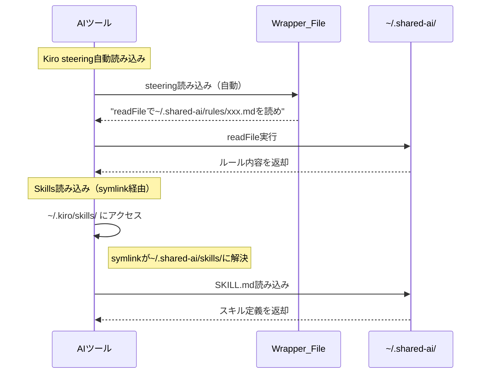
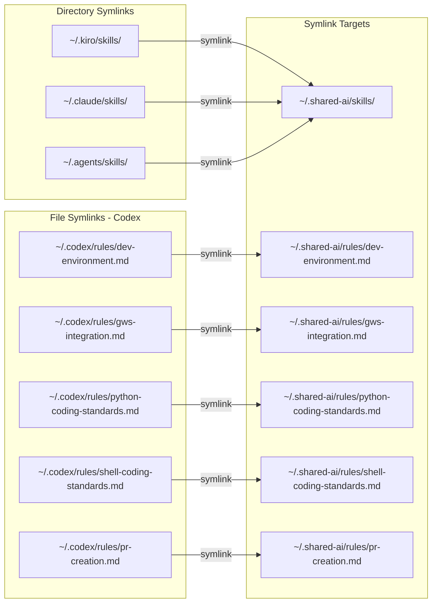
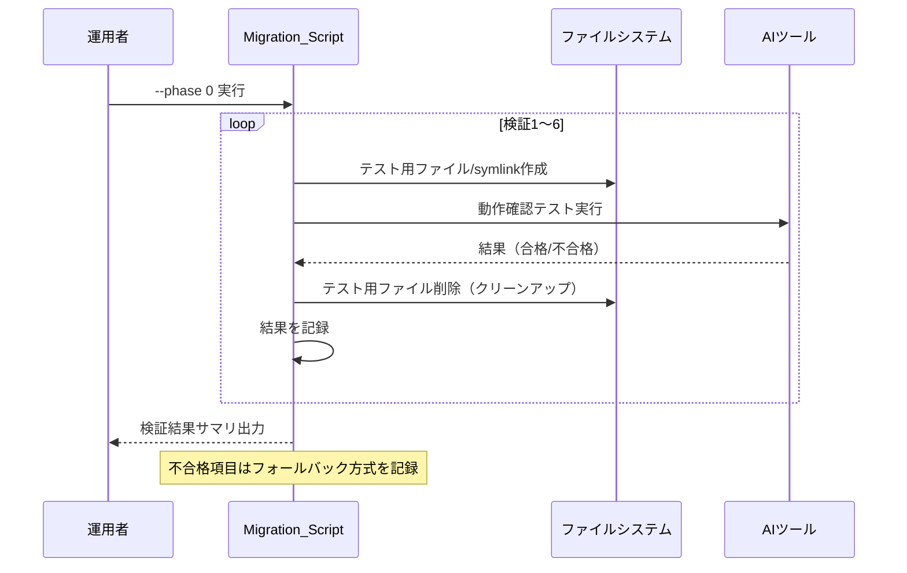
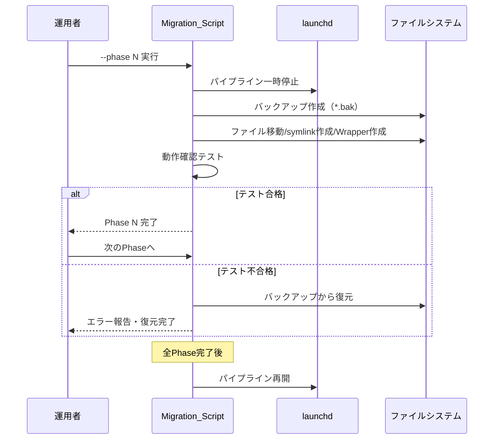

# 設計書

## 1. はじめに

### 1.1 目的

本設計書は、requirements.md（REQ-1〜REQ-8）で定義された要件を実現するための技術設計を記述する。Kiro / Claude Code / Codex CLI の3ツール間で重複管理されているmdファイル群を `~/.shared-ai/` に集約し、各ツール固有の参照機構（symlink、テキスト参照指示、ラッパーファイル）を通じて単一の真実の源（Single Source of Truth）から参照する構造へ移行する。

### 1.2 設計方針

本リファクタリングでは「各ツールの既存読み込み機構を一切変更しない」ことを最優先制約とする。各ツールが期待するファイルパス・ディレクトリ構造はそのまま維持し、ファイルシステムレベル（symlink）またはコンテンツレベル（テキスト参照指示）で共通ソースへの間接参照を実現する。

**代替案の検討:**

| 方式 | メリット | デメリット | 採否 |
|---|---|---|---|
| A: 全ファイルsymlink | 最もシンプル | Kiro steeringが親階層symlink非対応 | 部分採用 |
| B: rsync定期同期 | ツール制約に依存しない | 同期タイミングの不整合、cron管理コスト | フォールバック用 |
| C: ハイブリッド（本設計） | ツール制約に最適化 | 方式が混在し複雑 | 採用 |

方式Cを採用した理由: 各ツールの技術制約（Kiro steeringの親階層参照不可、Codex rulesの自動読み込み機構等）に個別対応しつつ、共通ソースの一元管理を実現できるため。

### 1.3 参照文書

- 要件定義書: `/Users/takeya_ozawa/.kiro/specs/shared-ai-knowledge-base/requirements.md`
- Issue: `/Users/takeya_ozawa/issues/shared-ai-knowledge-base.md`

## 2. アーキテクチャ

### 2.1 システム構成

```mermaid
graph TD
    subgraph "Single Source of Truth"
        SA["~/.shared-ai/"]
        SA_RULES["rules/"]
        SA_LOOKUPS["lookups/"]
        SA_PROMPTS["prompts/"]
        SA_REFS["references/"]
        SA_TEMPLATES["templates/"]
        SA_SKILLS["skills/"]
        SA --> SA_RULES
        SA --> SA_LOOKUPS
        SA --> SA_PROMPTS
        SA --> SA_REFS
        SA --> SA_TEMPLATES
        SA --> SA_SKILLS
    end

    subgraph "Kiro"
        K_STEERING["~/.kiro/steering/<br/>Wrapper Files"]
        K_SKILLS["~/.kiro/skills/<br/>symlink"]
        K_PROMPTS["~/.kiro/agents/prompts/<br/>Wrapper or file://"]
    end

    subgraph "Claude Code"
        C_CLAUDE["~/.claude/CLAUDE.md<br/>テキスト参照"]
        C_SKILLS["~/.claude/skills/<br/>symlink"]
    end

    subgraph "Codex CLI"
        X_AGENTS["~/.codex/AGENTS.md<br/>テキスト参照"]
        X_RULES["~/.codex/rules/<br/>個別symlink"]
    end

    subgraph ".agents (Google)"
        A_SKILLS["~/.agents/skills/<br/>symlink"]
    end

    K_STEERING -->|readFile| SA_RULES
    K_STEERING -->|readFile| SA_LOOKUPS
    K_STEERING -->|readFile| SA_TEMPLATES
    K_SKILLS -->|symlink| SA_SKILLS
    K_PROMPTS -->|readFile or file://| SA_PROMPTS

    C_CLAUDE -->|readFile| SA_RULES
    C_SKILLS -->|symlink| SA_SKILLS

    X_AGENTS -->|readFile| SA_RULES
    X_RULES -->|symlink| SA_RULES

    A_SKILLS -->|symlink| SA_SKILLS
```



### 2.2 レイヤー構成

本リファクタリングはファイルシステム構造の再編であり、アプリケーションレイヤーは存在しない。代わりに以下の論理レイヤーで整理する:

| レイヤー | 役割 | 構成要素 |
|---|---|---|
| 共通ソース層 | 全ツール共通のナレッジ実体 | `~/.shared-ai/` 配下の全ファイル |
| 参照層 | ツール固有の参照機構 | symlink、Wrapper_File、テキスト参照 |
| ツール層 | 各AIツールの読み込み機構 | Kiro steering自動注入、CLAUDE.md読み込み等 |

### 2.3 変更前後の対比

**変更前（現行構造）:**

```
~/.kiro/steering/dev-environment-rules.md     ← 実体（5KB）
~/.claude/CLAUDE.md                           ← 同内容をインライン記載
~/.codex/AGENTS.md                            ← 同内容をインライン記載

~/.kiro/skills/gws-gmail/SKILL.md             ← 実体
~/.claude/skills/gws-gmail/SKILL.md           ← 完全コピー
~/.agents/skills/gws-gmail/SKILL.md           ← 完全コピー
```

**変更後（移行後構造）:**

```
~/.shared-ai/rules/dev-environment.md         ← 唯一の実体
~/.kiro/steering/dev-environment-rules.md     ← Wrapper（readFile指示のみ）
~/.claude/CLAUDE.md                           ← 参照パス列挙
~/.codex/rules/dev-environment.md             ← symlink → shared-ai

~/.shared-ai/skills/gws-gmail/SKILL.md        ← 唯一の実体
~/.kiro/skills/                               ← symlink → ~/.shared-ai/skills/
~/.claude/skills/                             ← symlink → ~/.shared-ai/skills/
~/.agents/skills/                             ← symlink → ~/.shared-ai/skills/
```

### 2.4 互換性の確保

**後方互換性の維持方法:**

1. **パス互換**: 各ツールが期待するパス（`~/.kiro/skills/`, `~/.kiro/steering/*.md` 等）はそのまま存在し続ける。symlinkまたはWrapper_Fileにより、ツールからは従来と同じパスでアクセス可能
2. **内容互換**: ファイル内容は一切変更しない（リネームのみ）。Wrapper_File経由でreadFileされた場合も、元の内容がそのまま読み込まれる
3. **フォールバック**: 事前検証（REQ-1）で不合格の場合、rsync同期方式またはインライン展開方式にフォールバックし、機能劣化なく動作を保証する

**ロールバック手順:**

各Phaseでバックアップ（`*.bak`）を作成するため、問題発覚時は以下で即座に復元可能:

```bash
# skills の復元例
rm ~/.kiro/skills                    # symlinkを削除
mv ~/.kiro/skills.bak ~/.kiro/skills # バックアップから復元
```

## 3. コンポーネント設計

### 3.1 コンポーネント一覧

| コンポーネント | ファイルパス | 責務 | 新規/変更 |
|---|---|---|---|
| Shared_AI_Directory | `~/.shared-ai/` | 全ツール共通ナレッジの実体格納 | 新規 |
| README.md | `~/.shared-ai/README.md` | 構造説明・参照方法ガイド | 新規 |
| Kiro Steering Wrappers | `~/.kiro/steering/*.md` | readFile指示による間接参照 | 変更 |
| Kiro Agent Prompt Wrappers | `~/.kiro/agents/prompts/*.md` | readFile指示またはfile://参照 | 変更 |
| Skills Symlinks | `~/.kiro/skills/`, `~/.claude/skills/`, `~/.agents/skills/` | ディレクトリsymlink | 変更 |
| Codex Rules Symlinks | `~/.codex/rules/*.md` | 個別ファイルsymlink | 新規 |
| Claude CLAUDE.md | `~/.claude/CLAUDE.md` | 参照パス追記 | 変更 |
| Codex AGENTS.md | `~/.codex/AGENTS.md` | 参照パス記載 | 新規 |
| Migration_Script | `~/scripts/migrate-shared-ai.sh` | 移行自動化スクリプト | 新規 |

### 3.2 コンポーネント間インターフェース



### 3.3 主要コンポーネントの設計

#### 3.3.1 Wrapper_File の構造

```markdown
---
inclusion: always
description: {元のdescription}
---

# {元のタイトル}

以下のファイルをreadFileで読み込み、その指示に従うこと:
- `~/.shared-ai/{category}/{filename}.md`
```

#### 3.3.2 Migration_Script の設計

Migration_Scriptはbashスクリプトとして実装し、以下の機能を持つ:

- Phase引数による段階実行（`--phase 0|1|2|3|4|5|6`）
- `--dry-run` オプションによる事前確認
- 各操作前のバックアップ自動作成
- エラー時の自動ロールバック
- launchd一時停止/再開の自動制御

主要関数:

```bash
# Phase制御
run_phase() { local phase=$1; ... }

# バックアップ・復元
backup_directory() { local dir=$1; cp -r "$dir" "${dir}.bak"; }
restore_from_backup() { local dir=$1; rm -rf "$dir"; mv "${dir}.bak" "$dir"; }

# symlink作成
create_symlink() { local target=$1 link=$2; ln -s "$target" "$link"; }

# Wrapper_File生成
create_wrapper() {
    local original=$1 shared_path=$2 description=$3
    # front-matter + readFile指示を生成
}

# launchd制御
pause_launchd() { launchctl unload ~/Library/LaunchAgents/com.nyle.kiro-*.plist; }
resume_launchd() { launchctl load ~/Library/LaunchAgents/com.nyle.kiro-*.plist; }
```

#### 3.3.3 ファイルリネームマッピング

| 元ファイル名（Kiro steering） | 移行先パス |
|---|---|
| `dev-environment-rules.md` | `~/.shared-ai/rules/dev-environment.md` |
| `gws-integration-rules.md` | `~/.shared-ai/rules/gws-integration.md` |
| `python-script-coding-standards.md` | `~/.shared-ai/rules/python-coding-standards.md` |
| `shell-script-coding-standards.md` | `~/.shared-ai/rules/shell-coding-standards.md` |
| `pr-creation-base.md` | `~/.shared-ai/rules/pr-creation.md` |
| `slack-user-lookup-guide.md` | `~/.shared-ai/lookups/slack-user-lookup.md` |
| `notion-user-lookup-guide.md` | `~/.shared-ai/lookups/notion-user-lookup.md` |
| `slack-channel-mapping.md` | `~/.shared-ai/lookups/slack-channel-mapping.md` |
| `requirements-format-guide.md` | `~/.shared-ai/templates/requirements-format.md` |
| `design-format-guide.md` | `~/.shared-ai/templates/design-format.md` |
| `tasks-format-guide.md` | `~/.shared-ai/templates/tasks-format.md` |

## 4. データモデル

### 4.1 ディレクトリ構造（データモデルに相当）

本リファクタリングではDBテーブルは存在しない。ファイルシステム構造がデータモデルに相当する。

```
~/.shared-ai/
├── README.md
├── rules/
│   ├── dev-environment.md
│   ├── gws-integration.md
│   ├── python-coding-standards.md
│   ├── shell-coding-standards.md
│   └── pr-creation.md
├── lookups/
│   ├── slack-user-lookup.md
│   ├── notion-user-lookup.md
│   └── slack-channel-mapping.md
├── prompts/
│   ├── agent-creator.md
│   ├── slack-trend-scout.md
│   ├── tech-trend-scout.md
│   └── ...（全35ファイル）
├── references/
│   ├── agent-creation-guide.md
│   ├── agent-prompt-guide.md
│   ├── agent-pipeline-guide.md
│   ├── tech-trend-sources.md
│   └── ...（全9ファイル）
├── templates/
│   ├── requirements-format.md
│   ├── design-format.md
│   └── tasks-format.md
└── skills/
    ├── find-skills/
    ├── gws-gmail/
    ├── gws-drive/
    ├── gws-calendar/
    └── ...（全40+ディレクトリ）
```

### 4.2 symlink構成図



## 5. 処理フロー

### 5.1 Phase 0: 事前技術検証フロー



### 5.2 Phase 1〜5: 移行実行フロー



### 5.3 エラーハンドリング

| エラー状況 | 検知方法 | 対処 |
|---|---|---|
| symlink作成失敗 | `ln -s` の終了コード | バックアップから復元、フォールバック方式に切替 |
| ツールがsymlink先を解決できない | 検証テストの失敗 | rsync同期方式にフォールバック |
| Wrapper_Fileの参照指示が無視される | 検証6の不合格 | インライン展開方式にフォールバック |
| 移行中にlaunchdが実行される | launchd一時停止で防止 | 停止確認後に移行開始 |
| ディスク容量不足 | `cp`/`mv` の終了コード | 処理中断、バックアップ削除を提案 |

## 6. 外部インターフェース

### 6.1 各ツールの読み込みインターフェース

| ツール | 読み込み機構 | 期待するパス | 本設計での対応 |
|---|---|---|---|
| Kiro | steering自動注入 | `~/.kiro/steering/*.md` | Wrapper_File配置 |
| Kiro | skills自動検出 | `~/.kiro/skills/*/SKILL.md` | ディレクトリsymlink |
| Kiro | agent prompt | `file://./prompts/*.md` | ラッパーまたはfile://絶対パス |
| Claude Code | CLAUDE.md読み込み | `~/.claude/CLAUDE.md` | テキスト参照追記 |
| Claude Code | skills自動検出 | `~/.claude/skills/*/SKILL.md` | ディレクトリsymlink |
| Codex | AGENTS.md読み込み | `~/.codex/AGENTS.md` | テキスト参照記載 |
| Codex | rules自動読み込み | `~/.codex/rules/*.md` | 個別ファイルsymlink |
| .agents | skills自動検出 | `~/.agents/skills/*/SKILL.md` | ディレクトリsymlink |

### 6.2 launchd インターフェース

移行中のパイプライン制御:

```bash
# 一時停止
launchctl unload ~/Library/LaunchAgents/com.nyle.kiro-daily.plist
launchctl unload ~/Library/LaunchAgents/com.nyle.kiro-weekly.plist

# 再開
launchctl load ~/Library/LaunchAgents/com.nyle.kiro-daily.plist
launchctl load ~/Library/LaunchAgents/com.nyle.kiro-weekly.plist
```

## 7. セキュリティ考慮

該当なし。本リファクタリングはローカルファイルシステム内の操作のみであり、ネットワーク通信・認証・認可の変更は含まない。symlinkのパーミッションは元ファイルのパーミッションに従う。

## 8. テスト戦略

| テスト種別 | 対象 | 方針 | 対応要件 |
|---|---|---|---|
| 検証テスト | symlink対応（検証1〜3） | 各ツールでスキル呼び出し実行 | REQ-1.1〜1.3 |
| 検証テスト | file://参照（検証4） | Kiroエージェント起動テスト | REQ-1.4 |
| 検証テスト | Codex rules symlink（検証5） | Codexセッションでルール反映確認 | REQ-1.5 |
| 検証テスト | テキスト参照（検証6） | KiroセッションでreadFile実行確認 | REQ-1.6 |
| 結合テスト | Phase 2完了後 | 全ツールでGWSスキル実行 | REQ-3 |
| 結合テスト | Phase 3完了後 | Kiroセッションでルール適用確認 | REQ-4 |
| 結合テスト | Phase 4完了後 | 全カスタムエージェント起動テスト | REQ-5 |
| 結合テスト | Phase 5完了後 | Claude Code/Codexでルール反映確認 | REQ-6 |
| E2Eテスト | Phase 5完了後 | kiro-cliパイプライン（daily/weekly）完走 | REQ-7, REQ-8 |

## 9. 要件トレーサビリティ

| 要件ID | 受入基準 | 設計コンポーネント | テスト |
|---|---|---|---|
| REQ-1 | 1〜7 | Migration_Script（--phase 0） | 検証テスト1〜6 |
| REQ-2 | 1〜6 | Shared_AI_Directory, README.md | ディレクトリ構造確認 |
| REQ-3 | 1〜5 | Skills Symlinks | symlink後スキル実行テスト |
| REQ-4 | 1〜5 | Kiro Steering Wrappers | Wrapper経由ルール適用テスト |
| REQ-5 | 1〜3 | Kiro Agent Prompt Wrappers | エージェント起動テスト |
| REQ-6 | 1〜4 | Claude CLAUDE.md, Codex AGENTS.md, Codex Rules Symlinks | ツールセッションテスト |
| REQ-7 | 1〜3 | バックアップ削除処理 | パイプライン完走確認 |
| REQ-8 | 1〜3 | Migration_Script（launchd制御） | launchd停止/再開確認 |

## 10. 影響範囲

### 10.1 変更対象ファイル

**新規作成:**
- `~/.shared-ai/` ディレクトリ一式（README.md含む）
- `~/.codex/AGENTS.md`
- `~/.codex/rules/*.md`（symlink）
- `~/scripts/migrate-shared-ai.sh`

**変更（ラッパー化）:**
- `~/.kiro/steering/dev-environment-rules.md`
- `~/.kiro/steering/gws-integration-rules.md`
- `~/.kiro/steering/python-script-coding-standards.md`
- `~/.kiro/steering/shell-script-coding-standards.md`
- `~/.kiro/steering/pr-creation-base.md`
- `~/.kiro/steering/slack-user-lookup-guide.md`
- `~/.kiro/steering/notion-user-lookup-guide.md`
- `~/.kiro/steering/slack-channel-mapping.md`
- `~/.kiro/steering/requirements-format-guide.md`
- `~/.kiro/steering/design-format-guide.md`
- `~/.kiro/steering/tasks-format-guide.md`
- `~/.kiro/agents/prompts/*.md`（全35ファイル）
- `~/.claude/CLAUDE.md`

**変更（symlink化）:**
- `~/.kiro/skills/` → symlink
- `~/.claude/skills/` → symlink
- `~/.agents/skills/` → symlink

**変更なし（Kiro固有として残留）:**
- `~/.kiro/steering/steering-file-reference-rules.md`
- `~/.kiro/steering/knowledge-management-base.md`
- `~/.kiro/steering/agent-prompt-writing-guide.md`
- `~/.kiro/steering/agent-workflow-guide.md`
- `~/.kiro/steering/implementation-plan-guide.md`
- `~/.kiro/steering/task-management-guide.md`

### 10.2 既存機能への影響

#### 影響分析

| 影響を受ける機能 | 影響の種類 | 対処方針 | 確認方法 |
|---|---|---|---|
| Kiro steering自動読み込み | 直接 | Wrapper_Fileで間接参照を維持 | Phase 3後にルール適用テスト |
| Kiro agent起動 | 直接 | ラッパーまたはfile://で参照維持 | Phase 4後に全エージェント起動テスト |
| Kiro skills読み込み | 直接 | ディレクトリsymlinkで透過的アクセス | Phase 2後にGWSスキル実行テスト |
| Claude Code skills | 直接 | ディレクトリsymlinkで透過的アクセス | Phase 2後にスキル実行テスト |
| .agents skills | 直接 | ディレクトリsymlinkで透過的アクセス | Phase 2後にスキル実行テスト |
| kiro-cli パイプライン | 間接 | symlink解決テストを事前実施 | Phase 4後にdaily/weekly実行テスト |
| launchd自動実行 | 間接 | 移行中は一時停止で保護 | 移行完了後にパイプライン再開・実行確認 |

#### 後方互換性の確保

- **パス互換性**: 全ツールが期待するファイルパスはsymlinkまたはWrapper_Fileとして存在し続ける
- **内容互換性**: ファイル内容は変更しない（配置場所とリネームのみ）
- **動作互換性**: 各ツールの読み込み機構は一切変更しない

### 10.3 マイグレーション実行時の注意事項

- 移行前にlaunchdパイプライン（daily/weekly）を必ず一時停止する
- 各Phase完了後に動作確認を実施し、問題なければ次のPhaseに進む
- Phase間で最低1回はkiro-cliパイプラインの手動実行テストを行う
- 移行作業は業務時間外（パイプライン非実行時間帯）に実施することを推奨

### 10.4 ロールバック戦略

**Phase単位のロールバック:**

各Phaseでバックアップ（`*.bak`）を作成するため、問題発覚時は即座に復元可能:

```bash
# Phase 2（skills symlink化）のロールバック
rm ~/.kiro/skills && mv ~/.kiro/skills.bak ~/.kiro/skills
rm ~/.claude/skills && mv ~/.claude/skills.bak ~/.claude/skills
rm ~/.agents/skills && mv ~/.agents/skills.bak ~/.agents/skills

# Phase 3（steering ラッパー化）のロールバック
# 各ファイルのバックアップから復元
for f in ~/.kiro/steering/*.md.bak; do
    mv "$f" "${f%.bak}"
done
```

**完全ロールバック:**

全Phase完了後に問題が発覚した場合:
1. launchdパイプラインを停止
2. 全symlinkを削除し、バックアップから復元
3. `~/.shared-ai/` は削除せず残置（データ損失防止）
4. launchdパイプラインを再開

**Phase 6（バックアップ削除）の安全策:**
- 1週間の安定稼働確認後にのみ実施
- 削除前に最終動作確認チェックリストを実行
- kiro-cliパイプライン（daily/weekly）が正常に完走することを確認してから削除
